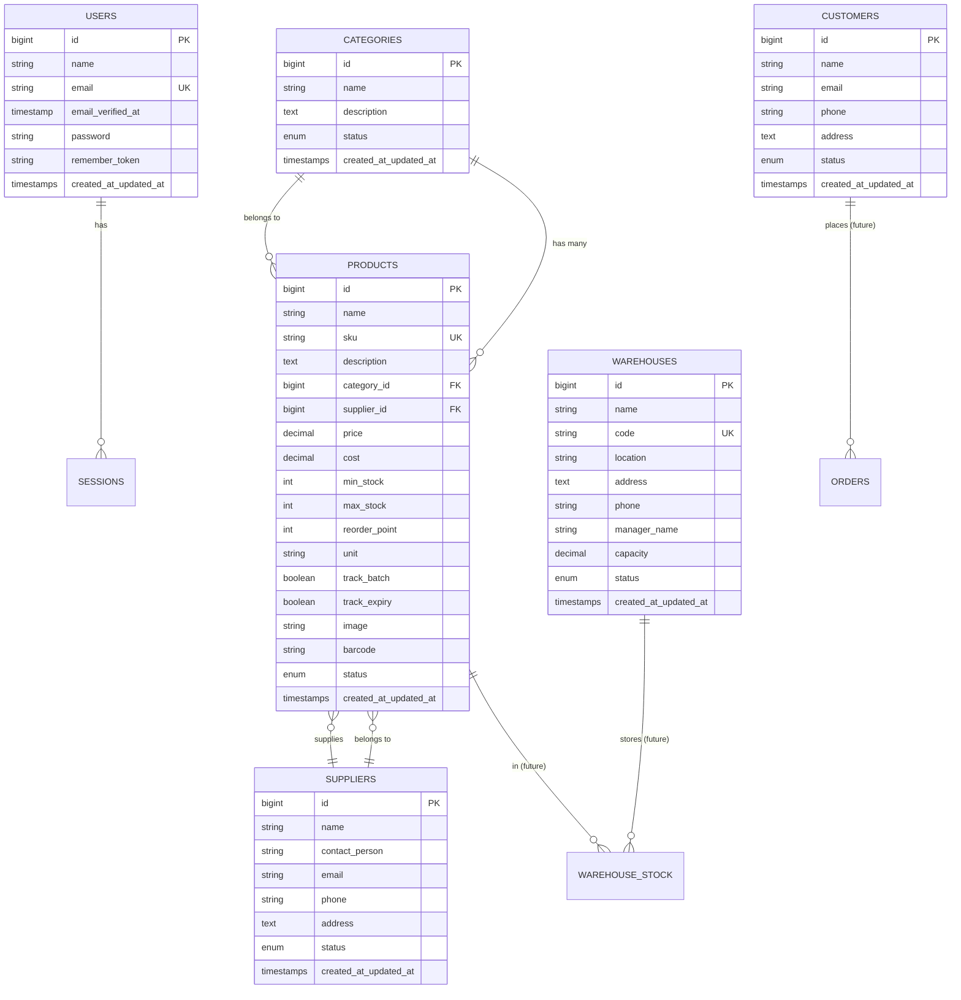

# 📦 Dokumentasi Sistem Manajemen Gudang

## 🎯 Overview Aplikasi

**Sistem Gudang** adalah aplikasi manajemen inventori dan gudang berbasis web yang dibangun menggunakan **Laravel 10**. Aplikasi ini dirancang untuk membantu perusahaan dalam mengelola stok produk, gudang, supplier, kategori, dan pelanggan secara efisien.

### Fitur Utama

- ✅ **Manajemen Produk** - CRUD produk dengan SKU, barcode, harga, stok, dan tracking batch/expiry
- ✅ **Manajemen Kategori** - Organisasi produk berdasarkan kategori
- ✅ **Manajemen Supplier** - Data supplier/vendor dengan informasi kontak lengkap
- ✅ **Manajemen Gudang** - Multiple warehouse management dengan kapasitas dan lokasi
- ✅ **Manajemen Customer** - Database pelanggan untuk order management
- ✅ **User Authentication** - Login system dengan role-based access
- ✅ **Dashboard** - Overview statistik dan data penting
- ✅ **Search & Filter** - Pencarian dan filter data di semua modul
- ✅ **Pagination** - Navigasi data yang efisien

---

## 🛠 Teknologi Stack

### Backend
- **Framework**: Laravel 10.x
- **PHP Version**: 8.1+
- **Database**: MySQL/MariaDB
- **Authentication**: Laravel Breeze/Sanctum

### Frontend
- **Template Engine**: Blade
- **CSS**: Vanilla CSS dengan custom design system
- **JavaScript**: Vanilla JS
- **Icons**: Font Awesome 6

### Tools & Dependencies
- **Composer** - PHP dependency manager
- **NPM/Vite** - Asset bundling
- **Git** - Version control

---

## 📊 Struktur Database

### Entity Relationship Diagram



### Tabel-Tabel Database

#### 1. **users**
Menyimpan data pengguna sistem dengan autentikasi.

| Kolom | Tipe | Deskripsi |
|-------|------|-----------|
| id | BIGINT | Primary key |
| name | VARCHAR(255) | Nama user |
| email | VARCHAR(255) | Email (unique) |
| password | VARCHAR(255) | Password (hashed) |
| created_at | TIMESTAMP | Waktu dibuat |

#### 2. **categories**
Kategori untuk klasifikasi produk.

| Kolom | Tipe | Deskripsi |
|-------|------|-----------|
| id | BIGINT | Primary key |
| name | VARCHAR(255) | Nama kategori |
| description | TEXT | Deskripsi kategori |
| status | ENUM | active/inactive |
| created_at | TIMESTAMP | Waktu dibuat |

#### 3. **suppliers**
Data supplier/vendor yang memasok produk.

| Kolom | Tipe | Deskripsi |
|-------|------|-----------|
| id | BIGINT | Primary key |
| name | VARCHAR(255) | Nama supplier |
| contact_person | VARCHAR(255) | PIC supplier |
| email | VARCHAR(255) | Email kontak |
| phone | VARCHAR(20) | Nomor telepon |
| address | TEXT | Alamat lengkap |
| status | ENUM | active/inactive |
| created_at | TIMESTAMP | Waktu dibuat |

#### 4. **customers**
Database pelanggan untuk transaksi.

| Kolom | Tipe | Deskripsi |
|-------|------|-----------|
| id | BIGINT | Primary key |
| name | VARCHAR(255) | Nama customer |
| email | VARCHAR(255) | Email customer |
| phone | VARCHAR(20) | Nomor telepon |
| address | TEXT | Alamat lengkap |
| status | ENUM | active/inactive |
| created_at | TIMESTAMP | Waktu dibuat |

#### 5. **warehouses**
Data gudang penyimpanan produk.

| Kolom | Tipe | Deskripsi |
|-------|------|-----------|
| id | BIGINT | Primary key |
| name | VARCHAR(255) | Nama gudang |
| code | VARCHAR(255) | Kode gudang (unique) |
| location | VARCHAR(255) | Lokasi/kota |
| address | TEXT | Alamat lengkap |
| phone | VARCHAR(20) | Telepon gudang |
| manager_name | VARCHAR(255) | Nama manager |
| capacity | DECIMAL(10,2) | Kapasitas (m²) |
| status | ENUM | active/inactive |
| created_at | TIMESTAMP | Waktu dibuat |

#### 6. **products**
Master data produk dengan informasi lengkap.

| Kolom | Tipe | Deskripsi |
|-------|------|-----------|
| id | BIGINT | Primary key |
| name | VARCHAR(255) | Nama produk |
| sku | VARCHAR(255) | Stock Keeping Unit (unique) |
| description | TEXT | Deskripsi produk |
| category_id | BIGINT | Foreign key ke categories |
| supplier_id | BIGINT | Foreign key ke suppliers |
| price | DECIMAL(15,2) | Harga jual |
| cost | DECIMAL(15,2) | Harga beli/modal |
| min_stock | INT | Stok minimum |
| max_stock | INT | Stok maksimum |
| reorder_point | INT | Titik reorder |
| unit | VARCHAR(50) | Satuan (pcs, box, dll) |
| track_batch | BOOLEAN | Track nomor batch |
| track_expiry | BOOLEAN | Track tanggal expired |
| image | VARCHAR(255) | Path gambar produk |
| barcode | VARCHAR(255) | Nomor barcode |
| status | ENUM | active/inactive |
| created_at | TIMESTAMP | Waktu dibuat |

### Relationships

```
Categories (1) ----< (N) Products
Suppliers (1) ----< (N) Products
Warehouses (1) ----< (N) WarehouseStock (future)
Products (1) ----< (N) WarehouseStock (future)
Customers (1) ----< (N) Orders (future)
```

---

## 🔄 Alur Sistem

### 1. Authentication Flow

```
┌─────────────┐
│   Browser   │
└──────┬──────┘
       │
       ▼
┌─────────────────┐
│  Login Page     │
│  /login         │
└──────┬──────────┘
       │ POST credentials
       ▼
┌─────────────────────┐
│ LoginController     │
│ - Validate          │
│ - Authenticate      │
│ - Create Session    │
└──────┬──────────────┘
       │
       ▼
┌─────────────────┐
│   Dashboard     │
│   /dashboard    │
└─────────────────┘
```

### 2. Product Management Flow

```
User Action → Route → Controller → Model → Database
                ↓         ↓         ↓
              View ←── Response ←──┘

Contoh: Create Product
1. User mengklik "Add Product"
2. Route: GET /products/create
3. ProductController@create
4. Load Categories & Suppliers dari database
5. Return view products.form
6. User mengisi form & submit
7. Route: POST /products
8. ProductController@store
9. Validate input
10. Product::create() → Insert ke database
11. Redirect ke /products dengan success message
```

### 3. Data Flow Diagram

```
┌─────────────────────────────────────────────────┐
│                   USER                          │
└────────┬────────────────────────────────────────┘
         │
         ▼
┌─────────────────────────────────────────────────┐
│              ROUTES (web.php)                   │
│  - /products, /categories, /suppliers, etc.     │
└────────┬────────────────────────────────────────┘
         │
         ▼
┌─────────────────────────────────────────────────┐
│              CONTROLLERS                        │
│  - ProductController                            │
│  - CategoryController                           │
│  - SupplierController                           │
│  - WarehouseController                          │
│  - CustomerController                           │
└────────┬────────────────────────────────────────┘
         │
         ▼
┌─────────────────────────────────────────────────┐
│              MODELS (Eloquent)                  │
│  - Product                                      │
│  - Category                                     │
│  - Supplier                                     │
│  - Warehouse                                    │
│  - Customer                                     │
└────────┬────────────────────────────────────────┘
         │
         ▼
┌─────────────────────────────────────────────────┐
│              DATABASE (MySQL)                   │
│  - products, categories, suppliers, etc.        │
└─────────────────────────────────────────────────┘
```

---

## 📁 Struktur Folder Aplikasi

```
sistem-gudang6/
├── app/
│   ├── Http/
│   │   └── Controllers/
│   │       ├── Auth/
│   │       │   └── LoginController.php
│   │       ├── CategoryController.php      # Manage categories
│   │       ├── CustomerController.php      # Manage customers
│   │       ├── DashboardController.php     # Dashboard stats
│   │       ├── ProductController.php       # Manage products
│   │       ├── SupplierController.php      # Manage suppliers
│   │       └── WarehouseController.php     # Manage warehouses
│   │
│   └── Models/
│       ├── User.php                        # User model
│       ├── Category.php                    # Category model
│       ├── Customer.php                    # Customer model
│       ├── Product.php                     # Product model
│       ├── Supplier.php                    # Supplier model
│       └── Warehouse.php                   # Warehouse model
│
├── database/
│   ├── migrations/                         # Database schema
│   │   ├── 2014_10_12_000000_create_users_table.php
│   │   ├── 2025_11_28_000001_create_categories_table.php
│   │   ├── 2025_11_28_000002_create_suppliers_table.php
│   │   ├── 2025_11_28_000003_create_customers_table.php
│   │   ├── 2025_11_28_000004_create_products_table.php
│   │   └── 2026_01_09_000000_create_warehouses_table.php
│   │
│   └── seeders/                            # Sample data
│       ├── DatabaseSeeder.php
│       ├── UserSeeder.php
│       ├── CategorySeeder.php
│       ├── SupplierSeeder.php
│       ├── CustomerSeeder.php
│       ├── WarehouseSeeder.php
│       └── ProductSeeder.php
│
├── resources/
│   └── views/
│       ├── layouts/
│       │   └── app.blade.php               # Main layout
│       ├── auth/
│       │   └── login.blade.php             # Login page
│       ├── dashboard.blade.php             # Dashboard
│       ├── categories/
│       │   ├── index.blade.php             # List categories
│       │   └── form.blade.php              # Create/Edit form
│       ├── customers/
│       │   ├── index.blade.php             # List customers
│       │   ├── form.blade.php              # Create/Edit form
│       │   └── show.blade.php              # Customer detail
│       ├── products/
│       │   ├── index.blade.php             # List products
│       │   └── form.blade.php              # Create/Edit form
│       ├── suppliers/
│       │   ├── index.blade.php             # List suppliers
│       │   ├── form.blade.php              # Create/Edit form
│       │   └── show.blade.php              # Supplier detail
│       └── warehouses/
│           ├── index.blade.php             # List warehouses
│           ├── create.blade.php            # Create form
│           ├── edit.blade.php              # Edit form
│           └── show.blade.php              # Warehouse detail
│
└── routes/
    └── web.php                             # Web routes
```

---

## 🎨 Arsitektur MVC

Aplikasi ini menggunakan arsitektur **MVC (Model-View-Controller)** dari Laravel:

### Model (Data Layer)
- **Eloquent ORM** untuk interaksi database
- Mendefinisikan relationships antar tabel
- Data validation dan business logic

### View (Presentation Layer)
- **Blade templates** untuk rendering HTML
- Reusable components dan layouts
- Dynamic data binding

### Controller (Logic Layer)
- Handle HTTP requests
- Koordinasi antara Model dan View
- Business logic dan validation
- Response handling

### Flow Request-Response

```
HTTP Request
    ↓
Router (web.php)
    ↓
Middleware (auth, etc.)
    ↓
Controller
    ↓
Model (Database)
    ↓
Controller
    ↓
View (Blade)
    ↓
HTTP Response
```

---

## 🔐 Authentication & Authorization

### Login System

```php
// Route
Route::get('/login', [LoginController::class, 'showLoginForm']);
Route::post('/login', [LoginController::class, 'login']);

// Authentication Check
Route::middleware('auth')->group(function () {
    // Protected routes
});
```

### User Roles (Future Implementation)
- **Admin** - Full access
- **Manager** - Manage inventory
- **Staff** - View only

---

## 🚀 API Endpoints

### Products API

| Method | Endpoint | Controller | Description |
|--------|----------|------------|-------------|
| GET | /products | index() | List all products |
| GET | /products/create | create() | Show create form |
| POST | /products | store() | Save new product |
| GET | /products/{id} | show() | Show product detail |
| GET | /products/{id}/edit | edit() | Show edit form |
| PUT | /products/{id} | update() | Update product |
| DELETE | /products/{id} | destroy() | Delete product |

### Categories API

| Method | Endpoint | Controller | Description |
|--------|----------|------------|-------------|
| GET | /categories | index() | List all categories |
| GET | /categories/create | create() | Show create form |
| POST | /categories | store() | Save new category |
| GET | /categories/{id}/edit | edit() | Show edit form |
| PUT | /categories/{id} | update() | Update category |
| DELETE | /categories/{id} | destroy() | Delete category |

### Suppliers API

| Method | Endpoint | Controller | Description |
|--------|----------|------------|-------------|
| GET | /suppliers | index() | List all suppliers |
| GET | /suppliers/create | create() | Show create form |
| POST | /suppliers | store() | Save new supplier |
| GET | /suppliers/{id} | show() | Show supplier detail |
| GET | /suppliers/{id}/edit | edit() | Show edit form |
| PUT | /suppliers/{id} | update() | Update supplier |
| DELETE | /suppliers/{id} | destroy() | Delete supplier |

### Warehouses API

| Method | Endpoint | Controller | Description |
|--------|----------|------------|-------------|
| GET | /warehouses | index() | List all warehouses |
| GET | /warehouses/create | create() | Show create form |
| POST | /warehouses | store() | Save new warehouse |
| GET | /warehouses/{id} | show() | Show warehouse detail |
| GET | /warehouses/{id}/edit | edit() | Show edit form |
| PUT | /warehouses/{id} | update() | Update warehouse |
| DELETE | /warehouses/{id} | destroy() | Delete warehouse |

### Customers API

| Method | Endpoint | Controller | Description |
|--------|----------|------------|-------------|
| GET | /customers | index() | List all customers |
| GET | /customers/create | create() | Show create form |
| POST | /customers | store() | Save new customer |
| GET | /customers/{id} | show() | Show customer detail |
| GET | /customers/{id}/edit | edit() | Show edit form |
| PUT | /customers/{id} | update() | Update customer |
| DELETE | /customers/{id} | destroy() | Delete customer |

---

## 💻 Cara Instalasi

### Prerequisites
- PHP 8.1 atau lebih tinggi
- Composer
- MySQL/MariaDB
- Node.js & NPM

### Step-by-Step Installation

```bash
# 1. Clone repository
git clone <repository-url>
cd sistem-gudang6

# 2. Install dependencies
composer install
npm install

# 3. Setup environment
cp .env.example .env
php artisan key:generate

# 4. Configure database di .env
DB_CONNECTION=mysql
DB_HOST=127.0.0.1
DB_PORT=3306
DB_DATABASE=sistem_gudang
DB_USERNAME=root
DB_PASSWORD=

# 5. Run migrations & seeders
php artisan migrate:fresh --seed

# 6. Build assets
npm run dev

# 7. Start server
php artisan serve
```

### Default Login Credentials

Setelah menjalankan seeder:
```
Email: admin@gudang.com
Password: password
```

---

## 📖 User Guide

### 1. Login ke Sistem
1. Akses `http://localhost:8000/login`
2. Masukkan email dan password
3. Klik "Login"

### 2. Mengelola Produk

#### Tambah Produk Baru
1. Klik menu **Products** di sidebar
2. Klik tombol **"Add Product"**
3. Isi form:
   - Name (required)
   - SKU (required, unique)
   - Category (pilih dari dropdown)
   - Supplier (pilih dari dropdown)
   - Price (harga jual)
   - Cost (harga beli)
   - Stock settings (min, max, reorder point)
   - Unit (satuan: pcs, box, dll)
   - Barcode
4. Klik **"Save Product"**

#### Edit Produk
1. Di halaman Products, klik icon **Edit** (✏️)
2. Update informasi yang diperlukan
3. Klik **"Update Product"**

#### Hapus Produk
1. Di halaman Products, klik icon **Delete** (🗑️)
2. Confirm penghapusan
3. Produk akan dihapus

### 3. Mengelola Kategori

#### Tambah Kategori
1. Klik menu **Categories**
2. Klik **"Add Category"**
3. Isi:
   - Name (required)
   - Description (optional)
   - Status (active/inactive)
4. Klik **"Save Category"**

### 4. Mengelola Supplier

#### Tambah Supplier
1. Klik menu **Suppliers**
2. Klik **"Add Supplier"**
3. Isi informasi supplier:
   - Name (required)
   - Contact Person
   - Email
   - Phone
   - Address
   - Status
4. Klik **"Save Supplier"**

### 5. Mengelola Gudang

#### Tambah Warehouse
1. Klik menu **Warehouses**
2. Klik **"Add Warehouse"**
3. Isi:
   - Name (required)
   - Code (required, unique)
   - Location
   - Address
   - Phone
   - Manager Name
   - Capacity (m²)
   - Status
4. Klik **"Save Warehouse"**

### 6. Search & Filter
- Setiap halaman index memiliki search box
- Ketik kata kunci dan klik **"Search"**
- Klik **"Clear"** untuk reset filter

---

## 🔮 Future Enhancements

### Planned Features

1. **Stock Management**
   - Stock In/Out transactions
   - Stock transfer between warehouses
   - Stock opname/adjustment
   - Real-time stock tracking

2. **Purchase Order**
   - Create PO to suppliers
   - PO approval workflow
   - Receive goods

3. **Sales Order**
   - Customer orders
   - Order fulfillment
   - Invoice generation

4. **Reporting**
   - Stock report by warehouse
   - Sales report
   - Purchase report
   - Low stock alerts
   - Export to Excel/PDF

5. **Additional Features**
   - Multi-user with roles
   - Activity logs
   - Notification system
   - Barcode scanning
   - Product images upload
   - API for mobile app

---

## 🐛 Troubleshooting

### Database Connection Error
```bash
# Check .env configuration
DB_CONNECTION=mysql
DB_HOST=127.0.0.1
DB_DATABASE=sistem_gudang

# Test connection
php artisan migrate:status
```

### Assets Not Loading
```bash
# Rebuild assets
npm run build

# Or run dev server
npm run dev
```

### Permission Error
```bash
# Linux/Mac
chmod -R 775 storage bootstrap/cache

# Windows - run as administrator
```

---

## 📞 Support & Contact

Untuk pertanyaan atau dukungan teknis, silakan hubungi tim development.

---

## 📄 License

Laravel is open-sourced software licensed under the [MIT license](https://opensource.org/licenses/MIT).

---

**Dibuat dengan ❤️ menggunakan Laravel 10**
